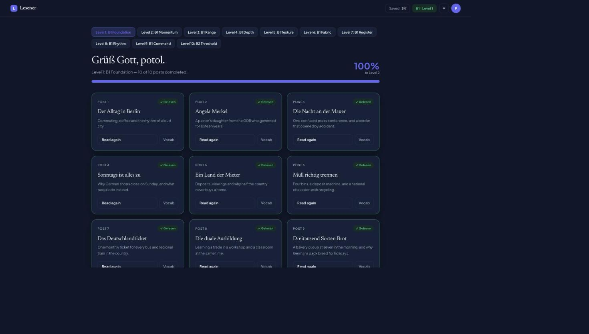
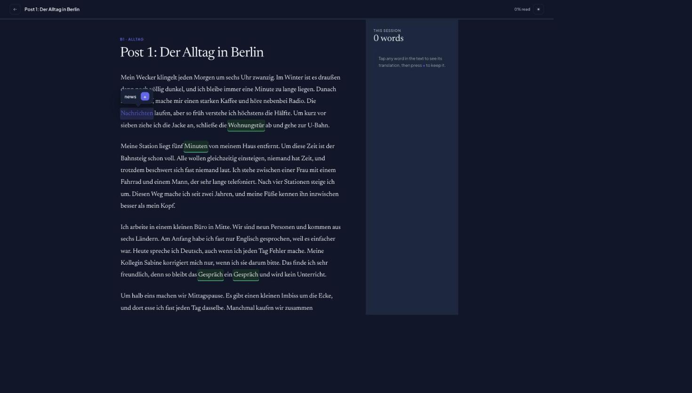
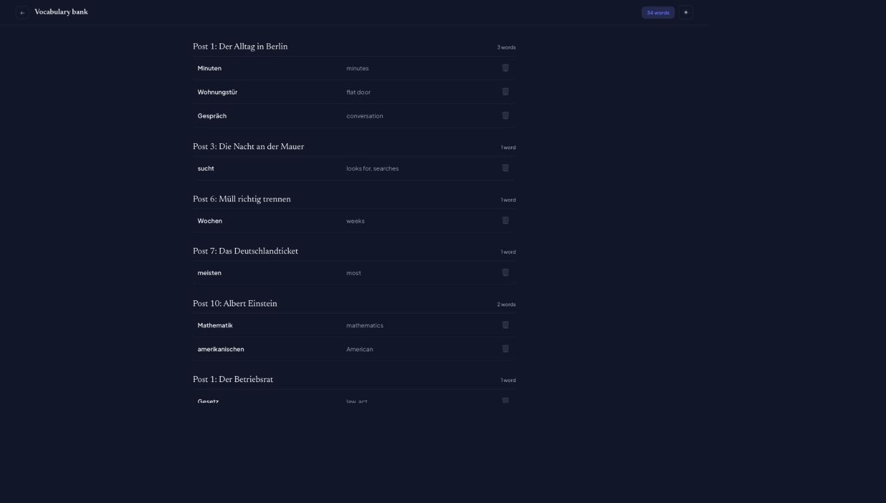

# Lesener

**A graded German reader.** Ten levels, a hundred hand-written posts, and a
dictionary behind every word on the page. Tap a word to see what it means, keep it
in a vocabulary bank, finish a level to open the next one.

Built to learn — both the German and the engineering.



## What it does

Reading in a foreign language stalls on the same thing every time: you hit a word
you do not know, you leave the page to look it up, and you do not come back. Lesener
puts the dictionary inside the paragraph.

- **A hundred posts across ten levels**, written for the level they sit on — 450 to
  650 words each, about German life, history, work, landscape and culture. Levels
  1–9 are B1. Level 10 is B2, deliberately: a taste of what comes next rather than
  the start of a second ladder.
- **Every word is tappable.** 8,170 dictionary rows cover every word the app can
  produce. Nothing renders as an em dash.
- **A vocabulary bank** that keeps what you saved, grouped by the post you found it
  in, and goes on saying where it came from even if that post changes.
- **Levels unlock in sequence**, and the rule is enforced by the database rather
  than by the interface.
- **Light and dark**, following your account rather than the browser, painted before
  the first frame so there is no white flash.

<table>
<tr>
<td width="50%"></td>
<td width="50%"></td>
</tr>
<tr>
<td>Tap any word. Press <b>+</b> to keep it.</td>
<td>The bank, grouped by where each word was found.</td>
</tr>
</table>

## Stack

| | |
|---|---|
| **Frontend** | React 19, Vite 8, plain JavaScript — no TypeScript, no router, no state library |
| **Backend** | Supabase: Postgres, PostgREST, GoTrue, one Edge Function. No server of our own |
| **Security** | Row-level security on all seven tables; `anon` revoked everywhere |
| **Tests** | Vitest + Testing Library (23 files, 252 cases) and 85 SQL assertions |
| **Lint** | oxlint |

Three runtime dependencies: `react`, `react-dom`, `@supabase/supabase-js`.

## Quickstart

```sh
npm install
cp .env.example .env     # then fill in the two values
npm run dev              # http://localhost:5173
```

> **You will need a Supabase project.** There is no local Supabase stack in this
> repo, so the app has to point at a remote one. If you are forking this rather than
> working on the original, [docs/local-setup.md](docs/local-setup.md) walks through
> creating your own project, applying the eight migrations and seeding all ten
> levels of content. It takes a while but it is written out in full.

| Command | |
|---|---|
| `npm run dev` | Dev server with HMR |
| `npm test` | Vitest, one shot |
| `npm run lint` | oxlint |
| `npm run build` | Production build into `dist/` |
| `npm run preview` | Serve the built output |

## Documentation

| Document | What is in it |
|---|---|
| [architecture.md](docs/architecture.md) | How the pieces fit: no router, one state container, the `src/lib/` boundary, the three write disciplines |
| [data-model.md](docs/data-model.md) | Every table, column, constraint, policy, function, trigger and index |
| [local-setup.md](docs/local-setup.md) | Clean checkout to running app, both paths, every environment variable |
| [testing.md](docs/testing.md) | Both suites, what they cover, and the two harness details that are load-bearing |
| [operations.md](docs/operations.md) | Applying migrations, deploying the Edge Function, seeding content, and what deploying the frontend would take |
| [security.md](docs/security.md) | The RLS posture, and the measured places where it is weaker than it looks |
| [content-authoring.md](docs/content-authoring.md) | How German prose becomes database rows, and what ten levels taught |
| [content-log.md](docs/content-log.md) | The per-level seeding and walkthrough journal |
| [decisions/](docs/decisions/) | Ten architecture decision records |
| [CONTRIBUTING.md](CONTRIBUTING.md) | The workflow, the gates, the commit style |

## Project status

**Feature-complete for what it set out to be, and not deployed.**

Working: all ten levels seeded and verified by checksum; sign-up, sign-in, password
reset and change; account deletion that actually deletes; reading progress and level
unlocking; the vocabulary bank; profile names; theme following the account.

Knowingly unfinished, and none of it hidden:

- **The German has been read by nobody but the model that wrote it.** A wrong
  sentence in a learning app teaches the error. The mitigation is that correcting one
  is a file edit and a re-run.
- **Not deployed anywhere**, and there is no CI. Three things would need fixing
  first: `mailer_autoconfirm` is on with no mail sender configured, leaked-password
  protection is switched off, and the deployed origin would need registering with
  Supabase Auth.
- **The level gate is not DRM.** A determined client can open the next level by
  writing session rows. Accepted — the content is free to read anyway.
- **Account deletion has no password-attempt limit.** Measured, not assumed: 140
  wrong passwords, zero refusals. It needs a per-account counter the schema does not
  have.
- **One Supabase project serves everything.** No staging.

The full list, with what was measured and when, is in
[docs/security.md](docs/security.md) and [docs/operations.md](docs/operations.md).

## Why it looks like this

A few decisions that a reader might otherwise take for oversights. All ten are
written up in [docs/decisions/](docs/decisions/).

- **No TypeScript.** The column list in each `.select()` is doing the job a type
  would. ([0002](docs/decisions/0002-plain-javascript-not-typescript.md))
- **No router, no state library.** Six screens and one 746-line container. The whole
  data flow is readable in one file; the cost is that there are no URLs.
  ([0009](docs/decisions/0009-no-router-no-state-library.md))
- **Content lives in the repo as files**, not in an admin UI, and is applied as data
  rather than as migrations — so a typo fix is a diff and a re-run.
  ([0004](docs/decisions/0004-content-as-files-upserted-by-position.md))
- **The level gate lives in SQL and is duplicated in JavaScript.** The copy decides
  only what to grey out; the database is still the enforcer.
  ([0005](docs/decisions/0005-level-gate-in-sql-with-a-client-copy.md))
- **The dictionary is fetched in pages.** PostgREST caps a response at 1,000 rows and
  says so only in a header — which cost 440 missing translations before it was found.
  ([0008](docs/decisions/0008-dictionary-paging-under-the-postgrest-cap.md))

## Licence

[MIT](LICENSE). A personal learning project by
[Shojib Mahmud](https://github.com/Shojibmahmud).
