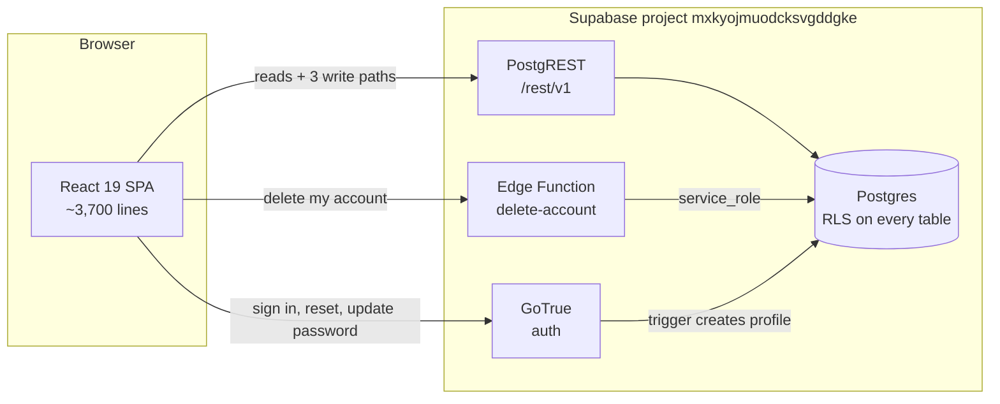

# Architecture

How Lesener is put together, and why it is put together that way.

For the schema itself see [data-model.md](data-model.md); for the threat model see
[security.md](security.md); for the decisions behind any of this, the numbered
records in [decisions/](decisions/).

## The shape in one sentence

Lesener is a static single-page app that talks straight to PostgREST, with one Edge
Function for the single thing the browser must not be trusted with.

There is no server of our own, no SSR, no API layer, no ORM, and no build step
beyond Vite. Three runtime dependencies: `react`, `react-dom`, `@supabase/supabase-js`.



The perimeter is row-level security, not application code. `anon` is revoked from
every table, so a signed-out request does not come back empty — it errors. This is
the reason the app can ship its Supabase key in the bundle and the reason there is
no backend to write.

## There is no router

A reader arriving from any other React codebase will look for routes and find none.
Navigation is **a single `screen` string in `App` state**:

```
landing → auth → dash → reader
            ↓      ↓  ↘
          reset    ↓   vocab
                 (modals)
```

| `screen` | Component | Needs a session |
|---|---|---|
| `landing` | `Landing.jsx` | no |
| `auth` | `AuthScreen.jsx` | no |
| `reset` | `NewPassword.jsx` | recovery session |
| `dash` | `Dashboard.jsx` | yes |
| `reader` | `Reader.jsx` | yes |
| `vocab` | `VocabBank.jsx` | yes |

Three **overlay states** are returned early, before the `screen` switch is reached:

- `!authReady` → a bare `<div>` holding `var(--bg)`, so a returning reader does not
  see Landing flash before their session is restored.
- `awaitingContent && status is idle|loading` → `ContentLoading.jsx`.
- `awaitingContent && (status is error || (ready && !level))` → `ContentError.jsx`.
  A library that loaded but produced no level is deliberately treated as a failure.

Four **modals** (`FinishModal`, `ChangePasswordModal`, `EditNameModal`,
`DeleteModal`) are booleans rendered alongside whatever screen is up.

Nothing is protected by a route guard, because there are no routes. Protection is
two layers, neither of them client-side navigation: the content fetch is keyed on
`user?.id` and clears everything when it is null, and the database refuses `anon`
outright. `Landing` stays reachable while signed in, so `goSignIn`/`goSignUp`
short-circuit to the dashboard.

## `App.jsx` is the state layer

One 746-line container holds **25 `useState`, 4 `useRef`, 3 `useMemo` and 5
`useEffect`**, and passes everything down as props — `Dashboard` alone takes 23.
There is no Context, no Redux, no Zustand, no react-query, no SWR.

That is a real decision rather than an omission ([ADR 0009](decisions/0009-no-router-no-state-library.md)).
At this size the whole data flow is readable in one file, and there is exactly one
place to look when state is wrong. The seam where it stops working is a second
screen that needs to write content state — at that point the prop lists stop being
legible and a store earns its keep.

The four refs exist to carry values that must **not** trigger a re-render or an
effect re-run:

| Ref | Why it cannot be state |
|---|---|
| `resetCompleted` | Distinguishes "finished a password reset" from an ordinary log-out; both fire `SIGNED_OUT`. |
| `unreadLinkError` | Stops an existing session binning an expired-link explanation before it is read. |
| `themeRef` | The profile effect must not depend on `theme`, or every toggle refetches the library, progress, words and profile. |
| `previouslyUnlocked` | Drives the level-opening refetch below. |

`.oxlintrc.json` carries no `exhaustive-deps` rule, so nothing would catch a stale
closure here automatically.

## Every network call lives in `src/lib/`

Components never touch Supabase. This is the single most load-bearing boundary in
the codebase — it is what lets the test suite mock one module and cover everything.

| Module | Responsibility |
|---|---|
| `supabase.js` | Creates the one client. Default options on purpose: session in `localStorage`, auto-refresh, so a reload keeps the reader signed in. |
| `query.js` | The read primitive. |
| `content.js` | `levels`, `posts`, `dictionary_entries` — read only. |
| `progress.js` | Reads `reading_progress`, writes `reading_sessions`. |
| `vocab.js` | The `saved_words` bank. |
| `profile.js` | Reads and updates `profiles`. |
| `account.js` | Invokes the `delete-account` Edge Function. |
| `levels.js` | The client-side copy of the level gate. |
| `recovery.js` | Snapshots the recovery link before supabase-js erases it. |
| `authUi.js` | Auth error vocabulary and shared form styling. |

### `query.js` — the read primitive

```js
export async function rows(build, what)
```

Two things it fixes, both real bugs rather than hypotheticals:

- **supabase-js resolves rather than rejects on a failed query.** An unchecked call
  silently yields `data: null` and the caller carries on with nothing. `rows` turns
  that into a throw carrying `Could not load ${what} [${code}]: ${message}`.
- **`PGRST303` — "JWT issued at future" — is retried once**, after 1.5 s. The
  service that issues a token and the service that validates it do not share a
  clock to the millisecond, so a token is briefly unusable in the moment after it
  is minted, which is exactly when the library is asked for. The symptom was that
  pressing Retry a second later always worked.

`build` is a **function, not a builder**, because a retry has to issue a fresh
request and an already-awaited builder cannot be made twice.

Everything else — a revoked grant, a genuinely expired token, an offline network —
is reported immediately rather than sat on for a second and a half first.

## The three write disciplines

A real convention, applied consistently, currently documented only in comments.

| Discipline | Used by | Rule |
|---|---|---|
| **Awaited, then reflected** | `saveWord`, `removeWord`, `finish` | The row must land before the UI moves. Something that appears and then vanishes on the next load is worse than something that never appeared. Each has its own failure flag (`saveWordFailed`, `removeWordFailed`, `saveFailed`) surfaced **where the action happened** — the Reader sidebar, the VocabBank banner, the FinishModal — and pressing the control again is the retry. |
| **Fire and forget** | `chooseTheme` → `updateProfileTheme`, `.catch(console.error)` | The local half already succeeded and a failure costs nothing visible on this device. The toggle must feel instant. |
| **Optimistic, authority deferred** | `setCompleted` | Kept in step locally, but the next load is the authority, not this array. |

The contrast is deliberate: a theme that fails to persist costs nothing, a saved
word that fails to persist is data the reader believes exists.

## How a sign-in becomes a screen

```
onAuthStateChange fires  →  setUser, setAuthReady
        ↓  userId changes
content effect fires
        ↓
Promise.all([ loadContent(), fetchProgress(), fetchSavedWords(), fetchProfile() ])
        ↓
reconcileTheme(profile)        ← before setContent, deliberately
        ↓
setContent / setCompleted / setSaved / setProfile / setContentStatus('ready')
        ↓
derived: levels, level, unlocked, postLabels, posts, postCount, post, done, pctLabel
        ↓
props → Dashboard | Reader | VocabBank
```

**All four fetches sit under one status.** A dashboard drawn from the library before
the reader's history arrived would show every card unread for a moment and then
correct itself, which looks exactly like progress being lost.

**`reconcileTheme` runs before `setContent`** so React batches both into the same
render, and the theme changes on the loading screen rather than as a repaint under a
dashboard already on screen.

`loadContent()` fetches posts **per level rather than in one sweep**, so
`postsByLevel[id].length` against `level.post_count` can tell "empty" from
"withheld".

### The self-terminating refetch

The library is fetched once per sign-in, but the level gate is reactive. Finishing
the last post of a level opens the next one immediately — while `postsByLevel` still
holds the empty list RLS handed over when that level was locked.

The effect at `src/App.jsx` (search for `previouslyUnlocked`) fires on the
**false→true transition only**, requires `post_count > 0`, and terminates on its own
because the refetch leaves the level open in both the previous and current maps.

## The level gate exists in two places

`private.has_level_access` in SQL is the enforcer. `src/lib/levels.js` is a
hand-maintained copy that decides only what to grey out, written because the
function lives in the non-exposed `private` schema and supabase-js cannot call it.

**Nothing checks the two against each other** — not the test suite, not a linter,
and there is no CI. If the SQL rule changes, that file must change with it, by hand.
This is the sharpest maintenance hazard in the codebase and is recorded as such in
[ADR 0005](decisions/0005-level-gate-in-sql-with-a-client-copy.md).

The copy also needs a step the SQL does not. Postgres sees every post; the client
sees only what RLS handed over, and a locked level hands over none — so "every
published post of the preceding level is completed" is *vacuously true* of it, which
would open level 3 for a reader still locked out of level 2. `levels.post_count`
tells the two apart, plus a recursive check that the preceding level is itself open.

## Theme, painted before React

Three tiers, in order:

1. **`index.html`** carries an inline, non-deferred script that reads
   `localStorage['lesener-theme']` and stamps `data-theme` on `<html>` before the
   first paint. It cannot be a module or carry a `src`, because either would defer
   it past the paint it exists to beat.
2. **`App.readStoredTheme()`** reads the same key synchronously into `useState`,
   validating rather than trusting — a hand-edited `'blue'` must not reach
   `setAttribute`.
3. **`reconcileTheme(profile)`** — the account's answer wins where it has one; where
   `theme` is null the device's current theme is adopted *into* the account.

That inline script also duplicates the two `--bg` colours in an inline `<style>`,
because in dev there is no stylesheet link at all — Vite injects CSS from
`main.jsx`, so the browser would paint its own white canvas first.

**Both copies are genuinely duplicated and nothing at runtime notices if they
drift** — the app goes on working perfectly and the white flash simply comes back.
`tests/theme-boot.test.js` is the only thing that will catch it.

## Recovery links are snapshotted at import time

`src/lib/recovery.js` has **import-time side effects** and is imported by
`main.jsx` *before* `App`, specifically to pin evaluation order: supabase-js erases
the recovery fragment as soon as it reads it.

It snapshots `window.location.hash`, exports `linkError` (mapped text for
`otp_expired`, `access_denied`, else a generic) and `startedInRecovery`, and clears
a *failed* link's hash — never a successful one, since the client still needs the
tokens.

`App` seeds `screen`, `authTab`, `authForgot`, `authMessage` and `recovering` from
these **synchronously**, which is what stops the dashboard flashing before
`PASSWORD_RECOVERY` arrives a tick later.

## Frontend conventions

- **Components are flat.** `src/components/` holds 15 files and no subdirectories.
- **Styling is inline style objects.** `src/index.css` (170 lines) holds only the
  light/dark custom properties, resets, keyframes (`pop`, `fade`, `rise`, `slideup`,
  `pulse`), a `prefers-reduced-motion` block, and six utility classes used by name:
  `.lift`, `.w` (a tappable word), `.btnp`, `.btng`, `.rowh`, `.trash`.
- **Shared auth-form styling lives in `src/lib/authUi.js`** — `inputStyle`,
  `labelStyle`, `messageStyle`, `errorMessageStyle`, `noticeMessageStyle`,
  `submitButtonStyle(busy)` — extracted because five forms share it.
- **Auth error text is mapped, not passed through.** `authUi.ERROR_TEXT` covers the
  codes the app can provoke, and `authErrorText(error)` falls through to
  `error.message` when unmapped.
- **Two different nothings are never worded alike.** A locked level reads
  "🔒 Level N is locked. Finish every post in Level N−1 to open it."; an empty level
  reads "No posts in this level yet." with deliberately nothing to press.
- **Grapheme-aware string handling where a name is involved.** `Dashboard.firstLetter`
  uses `Intl.Segmenter` with `granularity: 'grapheme'`, not `charAt(0)`: on a Bengali
  name `charAt(0)` takes the bare consonant and drops its vowel sign, and outside the
  BMP it returns half a surrogate pair. Scripts without letter case return the
  cluster unchanged from `toUpperCase()`, which is the correct answer.

## Known redundancy

**`public.level_progress` is built, granted, tested and never queried.** It computes
exactly the five figures the dashboard shows — `posts_total`, `posts_completed`,
`percent_complete`, `is_complete`, `is_unlocked` — and `App.jsx` derives all of them
client-side instead.

Either the view or the client-side duplication is dead weight. The view is not
useless: it is how the per-level gate predictions in [content-log.md](content-log.md)
were made by hand against the live database. But nothing in the shipped app reads
it, and that should be a deliberate choice rather than an accident.
