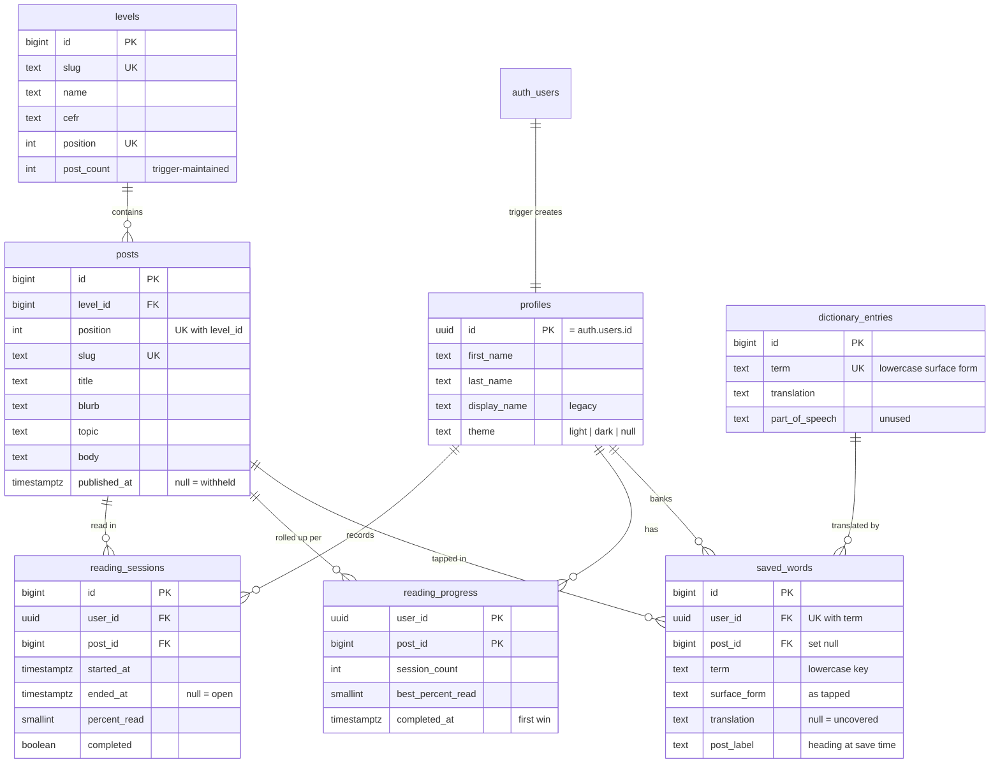

# Data model

Reference for the Postgres schema behind Lesener, on Supabase project
`mxkyojmuodcksvgddgke`.

This describes what the database *is*. The migration files in `supabase/migrations/`
are an append-only record of how it got that way and are never edited to match — so
where a migration comment and this document disagree, this document is the
correction. One such correction is called out under [`profiles.theme`](#theme).

- Applying a change: [operations.md](operations.md)
- Why the rules are the way they are: [security.md](security.md)
- Getting content into these tables: [content-authoring.md](content-authoring.md)

## Shape

Content is shared and owned by nobody. Everything else hangs off `auth.users`.



The app **reads** `levels`, `posts` and `dictionary_entries` on sign-in, alongside
its own `reading_progress`, `saved_words` and `profiles` rows. Everything a reader
sees of the library comes from these tables: post list, titles, blurbs, prose, topic
and level labels, counts, and the translation shown when a word is tapped.
Correcting any of them is a row edit, not a rebuild.

The app **writes** in three places only: a `reading_sessions` row at *Finish
reading*, a `saved_words` row when a word is banked (and a delete when it is
dropped), and `profiles` on a rename or theme change. It never writes
`reading_progress` — that is trigger-maintained. A session is recorded at Finish
rather than when a post opens, so abandoning a post leaves no trace.

---

## The shared library

Written by `service_role` only. See [content-authoring.md](content-authoring.md)
for how rows get here.

### `levels`

| Column | Type | Constraints |
|---|---|---|
| `id` | `bigint` | PK, `generated always as identity` |
| `slug` | `text` | not null, unique |
| `name` | `text` | not null |
| `cefr` | `text` | not null, `check (cefr in ('A1','A2','B1','B2','C1','C2'))` |
| `position` | `int` | not null, unique |
| `post_count` | `int` | not null, default 0 — denormalised, trigger-maintained |
| `created_at` / `updated_at` | `timestamptz` | not null, default `now()` |

**`post_count` exists for one reason and it is not performance.** It counts every
post regardless of publication, and it is readable even for a level the caller is
locked out of. That is what lets the dashboard say "0 of 10" for a level whose post
rows RLS refuses to hand over — and, more importantly, what lets the client tell
*withheld* from *genuinely empty*. `post_count = 0` means the level has no posts;
an empty post list under `post_count > 0` means the level is locked. The two states
must never be worded alike in the UI.

Ten rows are seeded, positions 1–10. Positions 1–9 are `B1`; position 10
(`b2-threshold`) is `B2`, deliberately a preview of a separate future app rather
than the start of a B2 ladder here.

### `posts`

| Column | Type | Constraints |
|---|---|---|
| `id` | `bigint` | PK, identity |
| `level_id` | `bigint` | not null, → `levels(id)` **on delete restrict** |
| `position` | `int` | not null |
| `slug` | `text` | not null, unique |
| `title` | `text` | not null |
| `blurb` | `text` | not null — English, the dashboard card subtitle |
| `topic` | `text` | nullable — German, the reader eyebrow |
| `body` | `text` | not null |
| `published_at` | `timestamptz` | nullable — **null withholds the post** |
| `created_at` / `updated_at` | `timestamptz` | not null, default `now()` |
| | | **`unique (level_id, position)`** |

`body` holds prose with paragraphs separated by a blank line, matching the
`'\n\n'` split in `Reader.jsx`. A double blank line yields an empty leading token,
so exactly one is correct.

`unique (level_id, position)` is the seeder's upsert key, and that is load-bearing
rather than incidental — see [ADR 0004](decisions/0004-content-as-files-upserted-by-position.md).

`published_at = null` is how a post is retired. Never delete one.

### `dictionary_entries`

| Column | Type | Constraints |
|---|---|---|
| `id` | `bigint` | PK, identity |
| `term` | `text` | not null, unique, `check (term = lower(term))` |
| `translation` | `text` | not null |
| `part_of_speech` | `text` | nullable — **null on every row; nothing reads it** |
| `created_at` / `updated_at` | `timestamptz` | not null, default `now()` |

**`term` is a normalised surface form, not a lemma.** It must equal
`clean(raw).toLowerCase()`, where `clean` lives in `src/utils.js`:

```js
export function clean(word) {
  return word.replace(/[^A-Za-zÄÖÜäöüß-]/g, '');
}
```

A row whose term does not survive that transformation can never be matched by a tap,
however correct the German. The check constraint enforces the lowercasing half of
this; the other half is the author's responsibility, and
`.claude/skills/content-authoring/scripts/check_posts.py` is what catches it.

The dictionary is one table for the **whole app**. `term` is globally unique and
carries no `post_id`, so a word is defined once and every level's vocabulary merges
into the same rows. It currently holds 8,170 rows with full coverage of all ten
levels — no word anywhere in the app renders as an em dash.

---

## Per-user tables

### `profiles`

One row per account, created by the `on_auth_user_created` trigger rather than by
the client. The client holds an insert grant only so that the RLS policy has
something to guard; `src/lib/profile.js` has no insert path **and should never be
given one** — a client that can create its own profile can create a second.

| Column | Type | Constraints |
|---|---|---|
| `id` | `uuid` | PK, → `auth.users(id)` **on delete cascade** |
| `display_name` | `text` | nullable — legacy; read by the trigger, shown nowhere |
| `theme` | `text` | `check (theme in ('light','dark'))` |
| `first_name` | `text` | nullable, `profiles_first_name_clean` |
| `last_name` | `text` | nullable, `profiles_last_name_clean` |
| `created_at` / `updated_at` | `timestamptz` | not null, default `now()` |

Both name constraints read:

```sql
check (first_name = btrim(first_name)
       and first_name <> ''
       and char_length(first_name) <= 60)
```

**The name columns are nullable on purpose.** A `not null` here would make the
sign-up trigger raise on a sign-up carrying no metadata — and a trigger that raises
on an `auth.users` insert does not produce a bad profile, it fails account creation
outright.

**The cap counts characters, not bytes.** A 25-character Bengali name is already
over 60 bytes in UTF-8, so an `octet_length` cap would refuse real names in one
script while allowing a 60-character name in another.

These constraints police the *update* path, where the client owns the statement and
can report a refusal. The trigger cleans its input instead —
`nullif(left(btrim(...), 60), '')` — for the reason above.

A reader may clear their surname but not their first name. That rule is enforced in
`src/lib/profile.js`, because a nullable column cannot express it; the dashboard's
nameless-greeting fallback is a guard against a null that should be unreachable, not
a state anyone should be able to choose.

#### `theme`

There are two values and only two: `check (theme in ('light','dark'))`. The client
never writes anything else and deliberately does not validate on the way out — the
constraint is the rule, and `supabase/tests/rls_checks.sql` proves it refuses both
`'system'` and `'Dark'` (it is case-sensitive).

**Null means "not asked yet", not "follow the device."** The comment above the
column in `20260810103010_init_user_schema.sql:12` says otherwise and is superseded
by this paragraph: it describes a tri-state that was designed, never built, and
refused outright in Feature 6. Nothing in the client has ever read
`prefers-color-scheme`. The migration file is an append-only record of what was
applied and is not edited to match — see
[operations.md](operations.md#applying-a-migration) — so the stale sentence stays
where it is, and this is the correction.

Null should also be rare. The client adopts whatever theme the reader's device is
showing into the account on first sign-in, so an account stops being null after one
visit. From then on the account's value wins wherever they sign in. `localStorage`
remains the device's own copy and is what paints the first frame; the account is
what carries the choice to the next browser.

### `reading_sessions`

One row per completed pass through a post.

| Column | Type | Constraints |
|---|---|---|
| `id` | `bigint` | PK, identity |
| `user_id` | `uuid` | not null, → `profiles(id)` cascade |
| `post_id` | `bigint` | not null, → `posts(id)` cascade |
| `started_at` | `timestamptz` | not null, default `now()` |
| `ended_at` | `timestamptz` | nullable |
| `percent_read` | `smallint` | not null, default 0, `check between 0 and 100` |
| `completed` | `boolean` | not null, default false |
| | | `check (ended_at is null or ended_at >= started_at)` |

The client has `insert` and `update` but **no `delete` grant**, so a completion
cannot be taken back from the browser.

Two columns of that insert are less obvious than they look. Both were proven
against this database rather than against the test suite, which stubs it:

- **`ended_at` must be set.** `reading_sessions_one_open_idx` is unique on
  `(user_id, post_id)` *where `ended_at is null`*, so a null there survives the
  first finish and fails the second with **`23505`**.
- **`started_at` must be sent too, from the same clock reading as `ended_at`.**
  Letting it fall back to its `now()` default compares a timestamp the browser made
  *before* the request was sent against one Postgres evaluated *after* it arrived,
  so `ended_at` is earlier by at least the round trip and every insert fails with
  **`23514`**, however well the clocks agree.

`src/lib/progress.js` sends both from one `new Date()`.

### `reading_progress`

Trigger-maintained roll-up, one row per `(user, post)`.

| Column | Type | Constraints |
|---|---|---|
| `user_id` | `uuid` | not null, → `profiles(id)` cascade, **PK part** |
| `post_id` | `bigint` | not null, → `posts(id)` cascade, **PK part** |
| `session_count` | `int` | not null, default 0 |
| `best_percent_read` | `smallint` | not null, default 0, `check between 0 and 100` |
| `completed_at` | `timestamptz` | nullable — **first completion wins** |
| `first_read_at` | `timestamptz` | not null, default `now()` |
| `last_read_at` | `timestamptz` | not null, default `now()` |

`authenticated` holds `select` and nothing else, because this table is what the
level gate reads. Writing it from the client would be writing your own key.

A row exists whether or not the post was finished; `completed_at` is what separates
finishing from getting partway. `App.jsx` derives its completed set as
`progress.filter(r => r.completed_at).map(r => r.post_id)`.

### `saved_words`

The vocabulary bank.

| Column | Type | Constraints |
|---|---|---|
| `id` | `bigint` | PK, identity |
| `user_id` | `uuid` | not null, → `profiles(id)` cascade |
| `post_id` | `bigint` | → `posts(id)` **on delete set null** |
| `session_id` | `bigint` | → `reading_sessions(id)` set null — **always null by design** |
| `dictionary_entry_id` | `bigint` | → `dictionary_entries(id)` set null |
| `term` | `text` | not null, `check (term = lower(term))` |
| `translation` | `text` | nullable |
| `surface_form` | `text` | not null |
| `post_label` | `text` | not null |
| `created_at` | `timestamptz` | not null, default `now()` |
| | | **`unique (user_id, term)`** |
| | | `saved_words_surface_form_matches: check (term = lower(surface_form))` |

Uniqueness is **per user and global, not per post**, matching `Reader.jsx`'s refusal
to bank the same word twice anywhere.

`translation` is nullable for words the dictionary does not cover, and is stored as
`NULL` rather than as the em dash the reader is shown — otherwise an absent
translation could not be told from a real one.

Three columns describe one word and they are not interchangeable:

- **`term`** — the lowercase key. What `unique (user_id, term)` and the dictionary
  both hinge on.
- **`surface_form`** — the word as the reader tapped it, and what the bank displays.
  German capitalises every noun in running text, so this is correct for free —
  except for a non-noun opening a sentence, which keeps that sentence's capital.
  Known limitation, accepted as separate work. The check constraint keeps the two
  columns honest, and is safe because `clean()` emits a closed alphabet on which
  Postgres `lower()` and JavaScript `toLowerCase()` agree character for character.
- **`post_label`** — the post heading as it read at save time, e.g.
  `'Post 1: Der Alltag in Berlin'`. A fallback, not an identity: the bank prefers
  the live title from the library so a rename reaches it, and reads this only when
  `post_id` resolves to nothing. Deliberately unconstrained against `post_id` — the
  point is to go on saying what it said then.

`session_id` is left null by design. Nothing writes a `reading_sessions` row until
the reader presses Finish, and words are saved before that, so there is no session
to point at.

A saved word outlives its post: `post_id` is `on delete set null`, and an
unpublished post is withheld by `posts_select_unlocked`, so the bank cannot always
look the heading up. `VocabBank.jsx` groups on `w.post_id ?? 'label:' + w.post_label`
so two words from two *different* vanished posts are not merged.

---

## The `level_progress` view

`security_invoker = on`, exposing `level_id, slug, name, cefr, position,
posts_total, posts_completed, percent_complete, is_complete, is_unlocked`.

`security_invoker` is load-bearing rather than stylistic: a view runs as its owner
by default, which would hand every caller every user's progress.

**The app never queries it.** `App.jsx` derives all five figures client-side from
`levels`, `postsByLevel` and its own progress rows. The view is built, granted,
tested — and unread. Either it or the client-side duplication is dead weight; see
[architecture.md](architecture.md#known-redundancy). It remains useful for
answering questions by hand against the live database, which is how the per-level
gate predictions in [content-log.md](content-log.md) were made.

---

## Functions

All four live in the `private` schema, which PostgREST does not expose, and all are
`security definer` with `set search_path = ''`.

| Function | Kind | What it does |
|---|---|---|
| `private.sync_level_post_count()` | trigger | Recomputes `levels.post_count`. On `UPDATE` it refreshes **both** old and new level, since a post may have moved. |
| `private.sync_reading_progress()` | trigger | Upserts the roll-up: `session_count + 1` on insert, `greatest()` on best percent, `coalesce(rp.completed_at, excluded.completed_at)` so **first completion wins**, `least()` on `first_read_at`. |
| `private.has_level_access(bigint)` | `stable`, RLS predicate | The level gate. |
| `private.handle_new_user()` | trigger | Creates the `profiles` row from `raw_user_meta_data`. |

### `has_level_access(p_level_id bigint)`

Level 1 is always open. Level N opens once every **published** post in level N−1
has a `reading_progress` row for the caller with `completed_at` set. A preceding
level with no published posts opens the next one vacuously.

Three properties matter:

- It takes the user from `auth.uid()` **internally** and never from an argument. A
  gate that trusted its caller to say who they were would not be a gate.
- It is `security definer` so it can read past `reading_progress`'s own RLS.
- It lives in `private`, so it is not callable as `/rest/v1/rpc/has_level_access`.

`execute` is revoked from `public` and `anon`, and granted to `authenticated` —
required, because RLS policy expressions evaluate as the querying role.

`src/lib/levels.js` is a hand-maintained **copy** of this rule, written because
supabase-js cannot call the real one. It decides only what to grey out; this
function is still the enforcer. If the rule here changes, that file changes with it.
See [ADR 0005](decisions/0005-level-gate-in-sql-with-a-client-copy.md).

### `handle_new_user()`

Started life in `public` and was moved to `private` by
`20260810103513_move_handle_new_user_to_private.sql`. The reason is worth keeping:
Postgres grants `execute` to `PUBLIC` on every new function, so a `security definer`
function sitting in `public` is reachable as `/rest/v1/rpc/<name>` by `anon` and
`authenticated` alike. Supabase's linter flags this as **0028/0029**.

It cleans its input rather than judging it, because raising here destroys the
account rather than the value.

---

## Triggers

| Trigger | Table | Timing | Function |
|---|---|---|---|
| `levels_set_updated_at` | `levels` | before update | `extensions.moddatetime` |
| `posts_set_updated_at` | `posts` | before update | `extensions.moddatetime` |
| `dictionary_entries_set_updated_at` | `dictionary_entries` | before update | `extensions.moddatetime` |
| `profiles_set_updated_at` | `profiles` | before update | `extensions.moddatetime` |
| `posts_sync_level_post_count` | `posts` | after insert / update of `level_id` / delete | `private.sync_level_post_count` |
| `reading_sessions_sync_progress` | `reading_sessions` | after insert or update | `private.sync_reading_progress` |
| `on_auth_user_created` | `auth.users` | after insert | `private.handle_new_user` |

## Indexes

Beyond the indexes backing every PK and unique constraint:

| Index | Table | Notes |
|---|---|---|
| `posts_level_id_idx` | `posts` | `(level_id)` |
| `reading_sessions_user_started_idx` | `reading_sessions` | `(user_id, started_at desc)` |
| `reading_sessions_post_id_idx` | `reading_sessions` | `(post_id)` |
| `reading_sessions_one_open_idx` | `reading_sessions` | **unique partial** on `(user_id, post_id) where ended_at is null` — the reason `ended_at` must be sent |
| `reading_progress_post_id_idx` | `reading_progress` | `(post_id)` |
| `reading_progress_completed_idx` | `reading_progress` | partial, `(user_id) where completed_at is not null` |
| `saved_words_user_created_idx` | `saved_words` | `(user_id, created_at desc)` |
| `saved_words_post_id_idx` · `saved_words_session_id_idx` · `saved_words_entry_id_idx` | `saved_words` | FK support |

`get_advisors(type: "performance")` reports several of these as unused. That is
expected while traffic is zero and is not a finding.

## Grants and RLS

Row-level security is enabled on all seven tables. **`anon` is revoked from every
table and from the view** — a signed-out request does not return empty, it errors.
That is load-bearing, and `src/lib/content.js` says so in a header comment.

```
authenticated  select                          levels, posts, dictionary_entries
authenticated  select, insert, update          profiles, reading_sessions
authenticated  select                          reading_progress
authenticated  select, insert, update, delete  saved_words
authenticated  select                          level_progress
```

Fourteen policies, all `to authenticated`. `auth.uid()` is always wrapped in a scalar
subquery — `(select auth.uid())` — so it evaluates once per statement rather than
once per row.

| Policy | Table | Command | Expression |
|---|---|---|---|
| `levels_select_all` | `levels` | select | `using (true)` |
| `dictionary_entries_select_all` | `dictionary_entries` | select | `using (true)` |
| `posts_select_unlocked` | `posts` | select | `using (published_at is not null and private.has_level_access(level_id))` |
| `profiles_select_own` | `profiles` | select | own |
| `profiles_insert_own` | `profiles` | insert | own (`with check`) |
| `profiles_update_own` | `profiles` | update | own, `using` + `with check` |
| `reading_sessions_select_own` | `reading_sessions` | select | own |
| `reading_sessions_insert_own` | `reading_sessions` | insert | own |
| `reading_sessions_update_own` | `reading_sessions` | update | own, both clauses |
| `reading_progress_select_own` | `reading_progress` | select | own — read-only by design |
| `saved_words_select_own` | `saved_words` | select | own |
| `saved_words_insert_own` | `saved_words` | insert | own |
| `saved_words_update_own` | `saved_words` | update | own, both clauses, so a row cannot be reassigned |
| `saved_words_delete_own` | `saved_words` | delete | own |

There is no `delete` policy on `profiles`, `reading_sessions` or `reading_progress`.
Account removal goes through the auth admin API and the `on delete cascade` chain —
see [operations.md](operations.md#the-delete-account-edge-function).

**A `USING`-only delete policy filters rather than raises.** Deleting somebody
else's row *succeeds*, having removed nothing. `src/lib/vocab.js` counts the
returned rows because that is the only way to tell the two apart. Proven against
this database, not inferred.

## Migration ledger

Applied in filename order. Append-only: a file that has been applied is never
edited.

| # | File | What it did |
|---|---|---|
| 1 | `20260810102912_init_content_schema.sql` | `levels`, `posts`, `dictionary_entries`; the `moddatetime` extension; the `private` schema; `sync_level_post_count`; RLS enabled |
| 2 | `20260810103010_init_user_schema.sql` | `profiles`, `reading_sessions`, `reading_progress`, `saved_words`; `handle_new_user` + `on_auth_user_created`; `sync_reading_progress`; indexes; RLS enabled |
| 3 | `20260810103130_rls_policies.sql` | Grants (`anon` revoked), `has_level_access`, all 14 policies |
| 4 | `20260810103206_level_progress_view.sql` | The `level_progress` view, `security_invoker = on` |
| 5 | `20260810103429_seed_b1_content.sql` | The original seed: 2 levels, 10 placeholder posts, 117 dictionary rows. **Superseded** — all of this content has since been overwritten via the file-based route |
| 6 | `20260810103513_move_handle_new_user_to_private.sql` | Moves `handle_new_user` from `public` to `private` (linter 0028/0029) |
| 7 | `20260819141500_saved_words_display_fields.sql` | `saved_words.surface_form`, `saved_words.post_label`, and the matching check. **The filename and the recorded version disagree** — see below |
| 8 | `20260819165432_profile_names.sql` | `profiles.first_name` / `last_name` + checks; teaches the trigger to read sign-up metadata; backfills existing accounts from the email local-part |

Migration 5 carries a `CONTENT WARNING` noting that its posts 3–10 hold placeholder
prose. It is accurate about what was applied on that day and is left alone; the
current content is described in [content-log.md](content-log.md).

### One recorded version does not match its filename

Verified against the live project on 2026-09-03. `supabase_migrations.schema_migrations`
holds **`20260819122109 saved_words_display_fields`**, while the file in this repo is
named `20260819141500_saved_words_display_fields.sql`. Same migration, same content,
two different timestamps — roughly two hours apart.

This breaks the rule stated in [operations.md](operations.md#applying-a-migration)
that every applied migration keeps a file under the same name, and it is the only
place the rule is broken. It has no runtime effect: the migration is applied, and
Postgres does not care what the local file is called. It would matter the moment
someone adopted the Supabase CLI, because `supabase migration list` compares the two
sets by version and would report this file as unapplied — and pushing it again would
fail on the already-existing columns.

Left as found rather than silently renamed, because renaming a migration file is a
history edit and that is a decision for the repository's owner.

## Known gaps in the model

- **`dictionary_entries.display_form` does not exist.** `src/assets/dictionary/de-en.tsv`
  already carries the data for all 8,170 rows, so the column is a migration away.
  Without it the bank can only ever show the surface form the reader tapped.
- **`part_of_speech` is null on every row and nothing reads it.** Either populate it
  or drop it; carrying an always-null column that no code consults is the worst of
  the three options.
- **No per-account attempt counter**, which is what a real rate limit on account
  deletion would need. See [security.md](security.md#no-limit-on-password-attempts).
